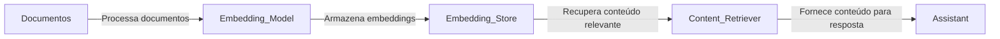

# Springrag

## Descrição do Projeto

O projeto **Springrag** é uma aplicação Spring Boot que utiliza a biblioteca LangChain4j para criar um assistente de chat baseado em documentos. Ele carrega documentos do sistema de arquivos, processa-os em embeddings e utiliza esses embeddings para recuperar conteúdo relevante em respostas de chat.

## Funcionalidades

- Carregamento de documentos do sistema de arquivos.
- Conversão de documentos em embeddings.
- Armazenamento de embeddings em memória.
- Recuperação de conteúdo relevante baseado em embeddings.
- Assistente de chat configurado para responder perguntas baseadas nos documentos carregados.

## Estrutura do Projeto

- `src/main/java/br/com/ganog/springrag/` - Código fonte principal.
- `src/main/resources/documents/` - Diretório onde os documentos são armazenados.
- `pom.xml` - Arquivo de configuração do Maven.

## Como Executar Localmente

### Pré-requisitos

- Java 21
- Maven

### Passos para Execução

1. Clone o repositório:
    ```sh
    git clone https://github.com/devkamaji/springrag.git
    cd springrag
    ```

2. Instale o Ollama na máquina:
    ```sh
    https://ollama.com/
    após instalação, execute o comando:
    ollama run llama3
    ```

3. Compile o projeto:
    ```sh
    mvn clean install
    ```

4. Execute a aplicação:
    ```sh
    mvn spring-boot:run
    ```

5. A aplicação estará disponível em `http://localhost:8080`.

### Endpoints

- `POST /rag` - Envia uma pergunta para o assistente configurado com recuperação de conteúdo.
- `POST /norag` - Envia uma pergunta para o assistente sem recuperação de conteúdo.

## Desenho do Funcionamento


